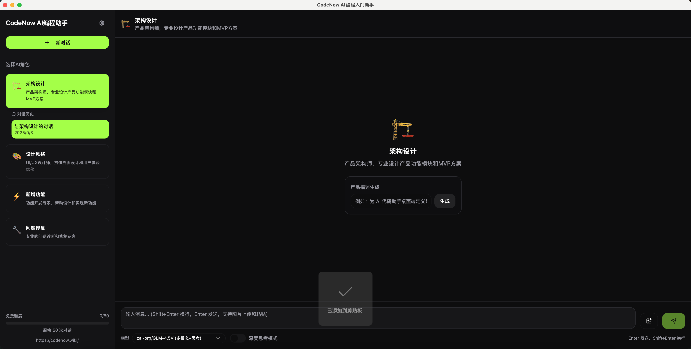
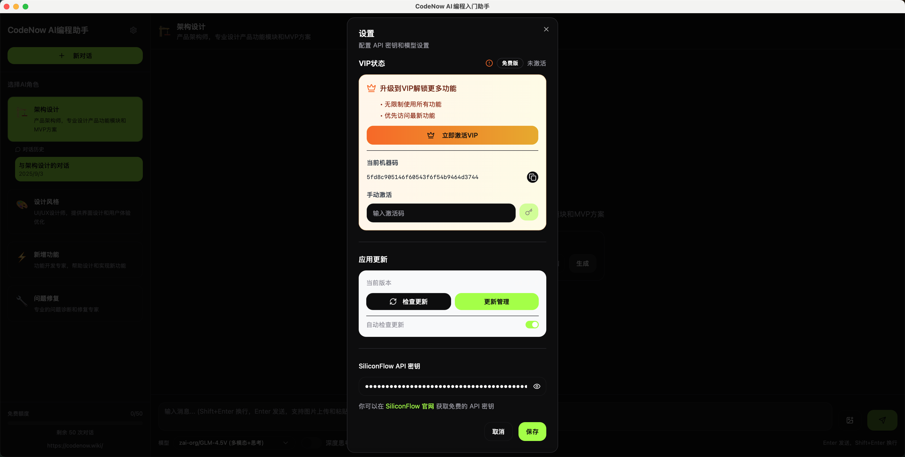

# CodeNow - 多角色AI编程助手

*让AI成为您的编程伙伴，一站式解决开发全流程问题*

[下载安装](#安装方式) • [功能特性](#功能特性) • [使用指南](#使用指南)

## ✨ 产品简介

**CodeNow** 是一款专为开发者打造的多角色AI编程助手桌面应用。通过集成多种专业的AI角色，为您提供全方位的编程支持。从产品架构设计到代码调试，从UI设计到功能开发，CodeNow让AI成为您值得信赖的编程伙伴。

## 🎯 核心功能

### 🤖 多角色AI助手
CodeNow集成了4个专业AI角色，每个角色都专注于特定领域：

- **🏗️ 架构设计专家** - 产品架构师，专业设计产品功能模块和MVP方案
- **🎨 设计风格专家** - UI/UX设计师，提供界面设计和用户体验优化
- **⚡ 新增功能专家** - 功能开发专家，帮助设计和实现新功能
- **🔧 问题修复专家** - 专业的问题诊断和修复专家

### 💬 智能聊天系统
- **多模态输入** - 支持文本、图片、语音(macOS后续支持)三种输入方式
- **实时流式回复** - AI回复实时显示，提供流畅的对话体验
- **多会话管理** - 为每个角色创建独立对话会话，支持会话切换、重命名和删除
- **智能上下文** - 保持对话上下文，确保连贯的交流体验

### 🔐 VIP会员系统
- **无限制使用** - VIP用户享受无限次对话，无次数限制
- **设备绑定激活** - 通过激活码机制安全激活VIP功能

## 🚀 安装方式

### 系统要求
- **操作系统**: macOS 10.15+, Windows 10+
- **内存**: 至少2GB可用内存
- **存储**: 至少100MB可用磁盘空间

### 下载安装
1. 访问 [GitHub Releases](https://github.com/xue160709/codenow_release) 页面
2. 下载对应您操作系统的安装包
3. 双击安装包并按照提示完成安装
4. 启动CodeNow应用

## 📖 使用指南

### 快速开始
1. **首次使用**: 启动应用后，系统会引导您完成初始设置
2. **配置API**: 在设置中配置您的AI模型API密钥
3. **选择角色**: 在侧边栏选择合适的AI角色开始对话
4. **开始对话**: 在输入框中输入您的问题或需求

### 角色使用建议
- **需要设计产品架构时** - 选择「架构设计专家」
- **需要UI/UX设计建议时** - 选择「设计风格专家」
- **开发新功能时** - 选择「新增功能专家」
- **遇到代码问题时** - 选择「问题修复专家」

### VIP功能激活
1. 在设置页面查看您的设备机器码
2. 通过官方渠道购买VIP激活码
3. 在设置页面输入激活码完成激活
4. 享受无限制的AI对话服务

## 🎨 界面预览

**主界面**

**设置**

## 📋 系统要求详解

| 组件 | 最低要求 | 推荐配置 |
|------|----------|----------|
| 操作系统 | Windows 10 / macOS 10.15 / Ubuntu 18.04 | Windows 11 / macOS 12+ |
| 内存 | 2GB RAM | 4GB+ RAM |
| 存储空间 | 100MB | 500MB+ |
| 网络 | 稳定网络连接 | 高速网络连接 |

## 🤝 反馈与支持

- **问题反馈**: 在 [GitHub Issues](https://github.com/your-repo/codenow-assistant/issues) 提交问题
- **功能建议**: 欢迎提交功能改进建议
- **技术支持**: 发送邮件至 xue160709@gmail.com 获取帮助

## 🙏 致谢

感谢所有为CodeNow项目做出贡献的开发者们！

---

**CodeNow - 让编程更有趣，更高效**

[⭐ 给项目点个星](https://github.com/your-repo/codenow-assistant) • [📖 详细文档](https://docs.codenow.com)

